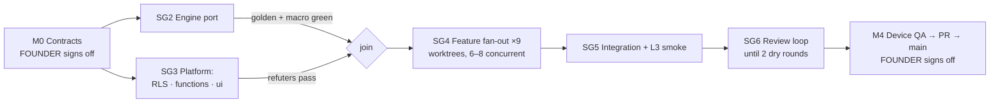
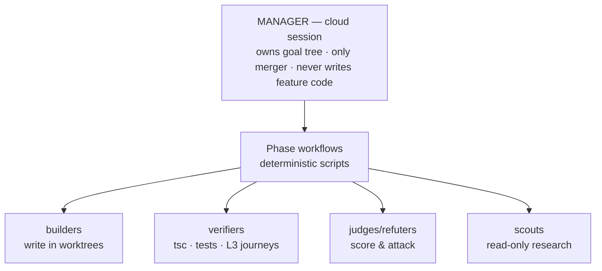
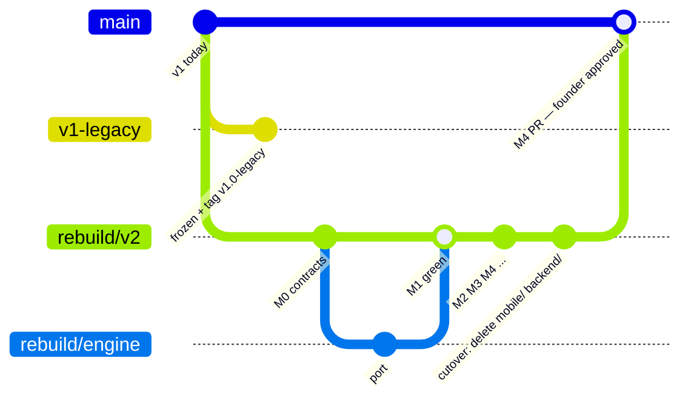

# Otto Rebuild — Orchestration Plan

Status: **approved blueprint, execution not started** (founder sessions 2026-07-21).
The target architecture is `docs/FRAMEWORK.md`. This doc is the **plan**: goals,
phases, agents, branches, and the cloud↔terminal split.

Companion docs — read the one you need, not all four:

| Doc | Role |
|---|---|
| `REBUILD_WORKFLOW.md` (this) | The plan — amended only at gates |
| `REBUILD_PACKETS.md` | The law agents run under — packet + message schemas |
| `REBUILD_STATE.md` | Living dashboard — the shared memory both sessions sync on |
| `TESTING.md` | The testing pyramid, journey scripts, credentials policy |

---

## 1. Main goal and guardrails

**Rebuild Otto on the target framework (~110 files) with all existing behavior
pinned green, while the old app keeps working untouched until cutover.**

Non-negotiable guardrails:

- The old app on `main` stays buildable/shippable the entire time.
- Behavior is pinned by the existing test suites (backend 101, mobile 53 —
  golden nutrition + macro-split included). A port that changes behavior fails,
  full stop.
- The honesty law carries over verbatim: null beats a guess, estimates are
  labelled, no fabricated numbers.
- Correctness work is never what gets cut under budget pressure (see §7).

## 2. Goal tree

```
MAIN GOAL
├── SG1  Contracts signed off              ← everything blocks on this
│    T1.1 schema+types · T1.2 engine API · T1.3 feature/ui contracts · T1.4 judge review
├── SG2  Engine ported, behavior-identical
│    T2.1 parse · T2.2 lookup · T2.3 compute+guards · T2.4 one data copy · T2.5 suites green
├── SG3  Platform track (parallel with SG2)
│    T3.1 RLS + attack tests · T3.2 five edge functions · T3.3 shared/ui + theme
├── SG4  Features (blocks on SG1–SG3)
│    T4.1–T4.9 one packet per features/* folder
├── SG5  Integration
│    T5.1 thin routes + providers + boot · T5.2 L3 journey smoke
└── SG6  Quality convergence
     T6.x review swarm → 3-vote verify → fix → repeat until 2 dry rounds
```

Atomicity rule (when something is a task, not a sub-goal): **(a)** one owner
directory, **(b)** testable acceptance criterion, **(c)** all inputs already
exist as contracts. Fails (c) → it's a dependency, not a task.

## 3. Phase DAG and gates



**Kick-off pattern: every gate is an artifact validation, never a schedule.**
An agent spawns only when its packet's `kickoff:` list checks green (files
exist on `rebuild/v2`, named checks pass). No artifact, no agent.

| Gate | Exit condition | Checked by |
|---|---|---|
| M0 Contracts | founder approves ~6 contract files | human |
| M1 Engine | golden + macro suites green on the TS port | automatic |
| M2 Platform | RLS survives 3 refuters; functions deploy; ui renders | automatic + judges |
| M3 Features | every packet accepted (schema → verify → merge) | automatic |
| M4 Converged | review loop dry ×2 → terminal device QA → founder review | human |

## 4. Agent model



Assignment is by rule, not by hand:

| Task smells like… | Specialist | Effort | Paired with |
|---|---|---|---|
| Mechanical port with pinning tests | builder | low | verifier running the suite |
| New interface / design decision | builder | high | 3-judge panel |
| Security-shaped (RLS, SSRF) | builder | high | 3 adversarial refuters |
| "Is this actually done?" | verifier | low | — |
| Research old code for a packet | scout | low | feeds manager |

**Folder ownership = write scope.** One folder, one agent:

| Folder | Agent | Kick-off inputs |
|---|---|---|
| `supabase/migrations/` | schema agent | FRAMEWORK.md (M0 start) |
| `src/types/` | generated — no agent | schema merged |
| `features/nutrition/engine/` | engine agent | engine API contract |
| `src/shared/ui/` + `theme/` | ui agent | token contract |
| `supabase/functions/*` | 5 function agents | schema + zod contracts |
| `features/*` (9) | 9 feature agents | types + engine + ui green |
| `app/` + layout | integration agent | all features merged |
| cross-cutting (read-only) | review swarm | M3 passed |

Ownership rules — enforced mechanically at merge, not by honor:

1. Write scope = your folder. Read scope = contracts + `src/types/` + old code.
   A diff outside the packet's owner path is rejected.
2. Shared folders have one owner. Needing a change there = file a
   `contract_gap` (see REBUILD_PACKETS.md), never edit it yourself.
3. The manager is the only merger. Agents never merge.

## 5. Concurrency

- Engine hard cap: `min(16, cores−2)` per workflow; excess queues.
- **Writers: max 6–8 concurrent** — binding constraint is merge-conflict
  surface, not compute. One writer per directory, each in its own worktree.
- Readers/verifiers/refuters: up to 10–16.
- **Minimum pairing: never a builder without its verifier.** An unverified
  green checkmark is how confidently-wrong code lands.
- Granularity floor: the feature folder. Never agent-per-file.
- No free-form agent chat — artifacts and structured messages only
  (REBUILD_PACKETS.md). Git is the message bus.

## 6. Branch strategy



- **`v1-legacy`** — frozen snapshot of today's app + tag `v1.0-legacy`. Never
  advances. The old project is one checkout away, forever.
- **`rebuild/v2`** — long-lived integration branch. All gates live here; it may
  be red mid-flight without touching main. **Old code stays present on this
  branch during the port** — agents need the old source and its tests in the
  same tree to pin behavior. The final pre-PR commit deletes `mobile/` +
  `backend/` so main's history shows one clean cutover.
- **`rebuild/<task>`** — one short-lived branch per packet (this IS the agent's
  worktree). Merged by the manager on verifier sign-off, then deleted.
- **`main`** — the working v1 app throughout (TestFlight keeps building from
  it). Receives exactly one PR, at M4, after founder approval.

## 7. Cloud ↔ terminal session split

**Cloud = rebuild manager + agent fleet. Terminal = hardware, secrets, final eyes.**
(~80% cloud / 20% terminal by volume; the terminal's 20% cannot be faked.)

| Capability | Cloud | Terminal |
|---|---|---|
| Multi-agent Workflow engine, hours-long runs | ✅ only | — |
| iOS simulator, device, visual verification | — | ✅ only |
| Secrets: USDA key, Supabase login, .env, EAS/TestFlight | — | ✅ only |
| Figma writes | — | ✅ |
| Browser (L3) testing | ✅ headless Playwright | ✅ Chrome MCP interactive |
| Code, git, node tests, tsc | ✅ | ✅ |

Per milestone: cloud runs M0–M3 end to end; terminal executes M2's real-project
steps (supabase link/migrations, `fix-table-identities.mjs` with the USDA key),
smoke-runs checkpoints on simulator during M3, and owns the M4 device QA +
EAS build. **Nothing merges to main on cloud's say-so alone.**

Protocol (the existing ticket pattern, tightened):

- Structured tickets only: kick-off condition, exact commands, expected output,
  and a **Report-back** section the terminal fills in. No cross-session chat.
- Terminal always `git pull --rebase` before acting; cloud never assumes a
  ticket ran until the report-back commit exists.
- Done tickets move to `docs/archive/`.
- `REBUILD_STATE.md` is read first, updated last, by both sessions — the
  manager is its only writer; terminal report-backs get folded in.
- **One manager.** The cloud session owns the goal tree for the rebuild; the
  terminal executes tickets and reports back. Disagreement goes in the
  report-back, and the manager re-decomposes. (Day-to-day v1 work keeps the
  existing terminal-lead convention; revisit after cutover.)

## 8. Re-decomposition triggers

The plan re-plans at defined points, not continuously:

1. **A task fails verification twice** → never a third retry; the manager
   splits the task or fixes its packet. Twice-failed = bad decomposition, not
   a bad agent.
2. **`contract_gap` filed** → builder stops improvising; manager amends the
   contract file, re-issues affected packets.
3. **Budget pressure** → SG6 shrinks first (fewer lenses per round). SG4
   correctness work is never cut.

## 9. Human touchpoints

Exactly three, plus escalations: **M0** (read ~6 contract files), **M4**
(device QA + final PR), and any `AskUserQuestion` an agent escalates through
the manager. Everything between runs autonomously behind automatic gates.

## 10. Open decisions (tracked in REBUILD_STATE.md)

- Commit the publishable Supabase anon key so cloud L3 runs autonomously?
- Authed E2E terminal-only (lean: yes, until the rebuild stabilizes)?
- SG4 in one wave of 6–8 or two waves of 4–5 (two waves = earlier integration
  signal, slightly slower)?
- `v1-legacy` carries a small README pointing at the docs snapshot?
