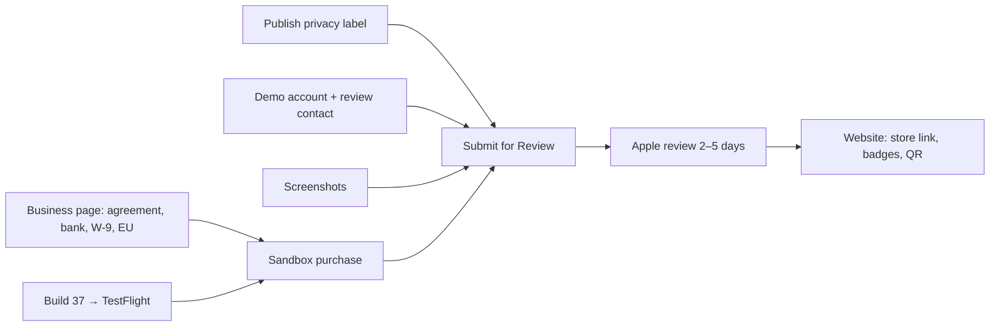

# Otto Launch Roadmap

As of 2026-09-24 · Juan Diego Lugo. Living copy: https://claude.ai/artifact/6HXbQRc9X1nfWpeiHAABRE

Otto ships with Otto Club for sale. Payments, the store listing text, the age rating and the
privacy answers are set up; what still blocks submission is the Paid Apps Agreement, a demo
account, screenshots and build 37.

Priority: **P0** blocks submission · **P1** needed before or on launch day · **P2** can follow.
Status: `todo` · `doing` · `blocked` · `done`.

## Where we are (2026-09-24)

The money path is wired end to end; nothing has been charged yet because the Paid Apps
Agreement is still pending.

| Area | Done today | Verified how |
| --- | --- | --- |
| App Store Connect | Group **Otto Club**: `otto_club_yearly` $39.99/yr and `otto_club_monthly` $4.99/mo, 1-week free trial on both, all 175 countries, display names set. Subtitle, categories (Food & Drink / Lifestyle), promo text, description, keywords, support/marketing/privacy URLs, copyright, review notes. Age rating computed **13+**. Seven privacy data types answered. Server Notifications point at RevenueCat. | Reloaded each page after saving |
| RevenueCat | App Store app `com.otto.recipes` with the IAP key (HTA6549CWG). Both products imported and attached to the `club` entitlement. Default offering: `$rc_annual` → yearly, `$rc_monthly` → monthly. Old "…Pro" entitlement deleted; Test Store products inactive and detached. Webhook → Supabase, all events, sandbox + production. | Read back on the entitlement, offering and webhook pages |
| App code | `RC_API_KEY` is the public `appl_` key; Test Store branches removed; fallback copy matches store ($39.99 / $4.99 / 7 days). Commit `f946bcae` on `main`. | `tsc` clean, 316/316 tests pass |
| Website | Pricing corrected on 9 pages + `llms.txt`; commit `05c668d`; Vercel deployed. | `ottosapp.com` and `/support` show $39.99 and 1-week trial |
| Supabase | No change needed. `revenuecat-webhook` (v4, live) checks entitlement `club`; `memberships` has RLS on, 0 rows. | Read the deployed function source and table |
| TestFlight | Build 36 (1.0.18) is "Ready to Submit", expires in 29 days. EAS CLI logged in. | ASC TestFlight page, `eas build:list` |

## Critical path to submission

Ten steps stand between today and "Submitted for Review". Juan owns the four that need a
legal signature, a login or a password; Claude owns the rest. The Business page and build 37
can run in parallel; the sandbox purchase needs both; Submit needs everything above it.

| # | Step | Owner | Blocked by | Status |
| --- | --- | --- | --- | --- |
| 1 | Business page: accept the updated Developer Program License Agreement, add bank account, submit W-9, declare EU trader status. Wait for Paid Apps Agreement = **Active** (Apple: hours to 2 days). | Juan | — | doing |
| 2 | App Privacy → **Publish** (top right). Answers are saved; the click is an accuracy attestation. | Juan | — | todo |
| 3 | Demo account: create a non-founder account in the app; Claude seeds it (saved recipes, week plan, shopping list); Juan types the email + password and his phone number into App Review Information and saves. | Juan + Claude | — | todo |
| 4 | Screenshots: six 6.9" store shots (iPhone 17 Pro Max simulator) + one paywall shot per subscription, uploaded to the version page and to each product's Review Information. | Claude | — | todo |
| 5 | Build 37: bump `expo.version` to 1.0.19 and `ios.buildNumber` to 37, set the ASC version string to match, `eas build` + `eas submit`, attach to the version. Build 36 must not ship (missing iPhone-only flag + privacy manifest). | Claude | — | todo |
| 6 | Set `EXPO_PUBLIC_USE_OTTO_RECIPES=true` for the `production` profile in `eas.json` before building 37, so the shipped app reads Otto's own recipe database as its copy claims. Smoke-test Discover, search, detail, nutrition. | Claude | — | todo |
| 7 | Sandbox purchase: create a Sandbox Apple ID (Users and Access → Sandbox), buy Otto Club in the TestFlight build, confirm the `club` entitlement unlocks and a row lands in `memberships`. Then Restore. | Juan (device) + Claude (verify) | 1, 5 | blocked |
| 8 | Attach the two subscriptions to the version and **Submit for Review**, release option "Automatically release after review". Log date + build in the publish ticket. | Juan | 1–7 | blocked |
| 9 | Apple review: answer any rejection the same day. Roughly 40% of first submissions are rejected; the usual causes (dead link, no demo login, privacy mismatch) are covered. | Both | 8 | blocked |
| 10 | Approval day: swap the website's "App Store link pending" QR for the real link, add store badges and the Smart App Banner, announce. | Claude | 9 | blocked |

## Apple Developer and App Store Connect

| ID | Ticket | Owner | Priority | Status |
| --- | --- | --- | --- | --- |
| ASC-1 | Accept the updated Apple Developer Program License Agreement (Account Holder only). Until accepted, Apple refuses new builds. | Juan | P0 | todo |
| ASC-2 | Business → Add Bank Account. | Juan | P0 | todo |
| ASC-3 | Business → Tax Forms → U.S. W-9 (required for any paid content, individual or not). | Juan | P0 | todo |
| ASC-4 | Business → Digital Services Act: declare trader or non-trader. Trader status publishes name, address, phone and email on the EU App Store. Alternative: remove EU countries from availability for v1. | Juan (decision) | P0 | todo |
| ASC-5 | Fix the legal address on file: it reads "4726 e michign st" and ZIP "32812-52". Tax forms are checked against it. | Juan | P0 | todo |
| ASC-6 | App Privacy → Publish. The seven data types are saved; the click attests they are accurate. | Juan | P0 | todo |
| ASC-7 | App Review Information: phone number, demo account email and password. Apple will not save the section without the phone. Needs APP-2. | Juan | P0 | blocked |
| ASC-8 | Upload six 6.9" screenshots (1320×2868) to the version page, in the shot-list order: import, cook mode, week plan, shopping list, Discover or recipe detail, Ask Otto. | Claude | P0 | todo |
| ASC-9 | Add a paywall screenshot to Review Information on `otto_club_yearly` and `otto_club_monthly`. Apple rejects a product without one. | Claude | P0 | todo |
| ASC-10 | Set the App Store version string to 1.0.19 so build 37 can be attached (the version page currently says 1.0; TestFlight builds carry 1.0.x). | Claude | P0 | todo |
| ASC-11 | Pricing and Availability: confirm Free, all countries (minus the EU if ASC-4 says non-trader and excludes them). Not yet checked. | Claude | P0 | todo |
| ASC-12 | App Information → Content Rights: declare that the app shows third-party content (TheMealDB recipes and photos) and that rights are held. Not yet checked. | Claude | P0 | todo |
| ASC-13 | Attach build 37 and add both subscriptions to the version, then Submit for Review with "Automatically release after review". | Juan | P0 | blocked |
| ASC-14 | Users and Access → Sandbox: create one Sandbox Apple ID for the test purchase. | Juan | P1 | todo |
| ASC-15 | Re-measure text lengths against the live limits. Entered today and accepted: subtitle 26/30, promo 144/170, keywords 92/100, description 1,597/4,000. | Claude | P1 | done |
| ASC-16 | Enroll in the Apple Small Business Program (15% commission instead of 30% under $1M/yr). Requires the Paid Apps Agreement to be Active first. | Juan | P1 | todo |

## App build and code

Build 37 is mandatory: build 36 predates the iPhone-only flag and the privacy manifest, so it
would ship as an iPad app with no declared manifest.

| ID | Ticket | Owner | Priority | Status |
| --- | --- | --- | --- | --- |
| APP-1 | Build 37: bump `expo.version` 1.0.18 → 1.0.19 and `ios.buildNumber` 36 → 37 in `app.json`, prebuild, `eas build --platform ios --profile production`, `eas submit`. About 30 minutes on EAS. | Claude | P0 | todo |
| APP-2 | Demo review account: Juan creates a non-founder account in the app (password stays with Juan); Claude seeds it through Supabase with saved recipes, a week plan and a shopping list so no screen is empty. Account name goes in the ticket log, never the password. | Juan + Claude | P0 | todo |
| APP-3 | `eas.json`: add `EXPO_PUBLIC_USE_OTTO_RECIPES=true` to the `production` and `preview` profiles. It exists only in `.env.development`, so release builds still query TheMealDB live while the app's copy says "Otto's own recipe database". Smoke-test Discover, search, detail, related and nutrition after. | Claude | P0 | todo |
| APP-4 | Sandbox purchase on the TestFlight build: buy, confirm `club` unlocks, confirm the paywall timeline reads "You'll be charged", Restore, and check the `memberships` row. | Juan (device) + Claude (verify) | P0 | blocked |
| APP-5 | `ProfileScreen.tsx:48` `RATE_APP_URL = null`: set the write-review deep link once the App Store ID exists. Until then "Rate Otto" only shows a toast. | Claude | P1 | blocked |
| APP-6 | Speech input: `useSpeechInput.ts` says on-device but never sets `requiresOnDeviceRecognition`, so dictated audio goes to Apple's servers. Decide: set it true (fewer languages, offline) or keep server recognition and say so in the privacy policy (LEG-2). | Juan (decision) + Claude | P1 | todo |
| APP-7 | Strip EXIF/GPS from uploaded recipe photos (HEIC library picks are uploaded untouched). Re-encode through `expo-image-manipulator` before upload. Pair with LEG-3. | Claude | P1 | todo |
| APP-8 | Add Sentry crash reporting, then tick Diagnostics on the privacy label. Needs a native rebuild, so it rides with 1.0.19 or later. | Claude | P2 | todo |
| APP-9 | Server-side enforcement of the free tier (5 imports/month, 25 saves, 5 asks/day) in the edge functions, counting against `memberships`. Today the limits live only in `club.limits.ts` on the device. | Claude | P2 | todo |
| APP-10 | Decide whether the week planner and smart shopping list are Club features. The go-live doc lists them as Club, but nothing gates them today. | Juan (decision) | P2 | todo |
| APP-11 | AI cost controls: log `input_tokens`/`output_tokens` per call (no content), then the five items in `docs/history/AI_COST_DIET.md` (measure, Haiku for chat, Sonnet for vision, trim prompts, Batch API for catalog jobs). | Claude | P2 | todo |
| APP-12 | Support address: keep `juandiego@ottosapp.com` in the app, on the site and on the listing. Decided 2026-09-24; `STORE_METADATA.md` still recommends `support@` and should be updated. | Juan | P1 | done |

## RevenueCat and payments

| ID | Ticket | Owner | Priority | Status |
| --- | --- | --- | --- | --- |
| RC-1 | See the sandbox purchase (APP-4) arrive in RevenueCat → Customers with the `club` entitlement active, and the webhook event delivered (Integrations → Webhooks → event log). The products' "Could not check" status clears after the subscriptions are submitted with the app. | Claude | P0 | blocked |
| RC-2 | Confirm what the `react-native-purchases` SDK collects (Device ID / IDFV) from RevenueCat's published disclosure for the pinned version, and adjust the privacy label if it names more than Device ID. | Claude | P1 | todo |
| RC-3 | Account deletion: the `delete-account` function removes Supabase data but leaves the RevenueCat subscriber. Add a `DELETE /v1/subscribers/{app_user_id}` call. | Claude | P2 | todo |
| RC-4 | Once ASC-16 is approved, turn on "Apple Small Business Program" in the RevenueCat app settings so revenue reporting uses 15%. | Claude | P2 | todo |
| RC-5 | Webhook signing: HMAC signing is off; the shared Authorization header is the only check. Turning it on needs a small change in `revenuecat-webhook/index.ts`. | Claude | P2 | todo |
| RC-6 | Optional: a RevenueCat Paywall or Experiment for the annual-vs-monthly price test in the ASO plan. Not before the first real cohort. | Juan (decision) | P2 | todo |

## Supabase and backend

Nothing here blocks submission. The live project's security advisor shows 3 warnings and the
performance advisor 14 (2026-09-24).

| ID | Ticket | Owner | Priority | Status |
| --- | --- | --- | --- | --- |
| SB-1 | Decide on the plan before launch: the free tier auto-pauses when idle (`keepalive.yml` prevents it today) and has no daily backups. Pro is $25/month and adds backups and no pause. | Juan (decision) | P1 | todo |
| SB-2 | Auth → enable leaked-password protection (HaveIBeenPwned check). One toggle; advisor warning. | Claude | P1 | todo |
| SB-3 | Settle privacy row 15: read edge-function logs for a `content/search.php?s=` request and record whether the search term and caller identity are retained, and for how long. Update the label if search history is kept. | Claude | P1 | todo |
| SB-4 | Settle privacy row D10: read one `auth.users.raw_user_meta_data` row per sign-in provider (Apple, Google, Facebook, password) and list which fields land. | Claude | P1 | todo |
| SB-5 | Advisor: `get_list_share`, `get_recipe_share` (anon) and `join_household` (authenticated) are SECURITY DEFINER and callable. Intentional for share links and invites; write that down in the migration comments so the warning is a known one. | Claude | P2 | todo |
| SB-6 | Advisor: five RLS policies on `households` and `household_members` re-evaluate `auth.uid()` per row; wrap as `(select auth.uid())`. `recipes` and `plan_entries` have duplicate permissive SELECT policies; merge. | Claude | P2 | todo |
| SB-7 | `recipe-photos` bucket is public-read with guessable `<uid>/<epoch_ms>` paths. Move to random object names or signed URLs. | Claude | P2 | todo |
| SB-8 | `resolved_ingredients` is readable by anon and is not cleared by account deletion; the free-text ingredient names a user typed become globally readable rows. Decide: keep (shared cache) or scope it. | Juan (decision) | P2 | todo |
| SB-9 | Rotate to the new publishable/secret API keys; the anon and service-role keys in use are marked deprecated in the dashboard. Touches the app's `.env` files, `keepalive.yml` and the edge functions. | Claude | P2 | todo |
| SB-10 | Seven unused indexes reported by the advisor. Leave until there is traffic to judge by. | Claude | P2 | todo |

## Website and Vercel

The site is correct for review today (pricing, privacy, terms, support all live). The one P0
is listing-day work that needs the App Store ID, which only exists after approval.

| ID | Ticket | Owner | Priority | Status |
| --- | --- | --- | --- | --- |
| WEB-1 | Approval day: set `APP_STORE_URL` and `APP_STORE_ID` in `lib/metadata.ts`. That links the store badge on seven pages, turns on the Smart App Banner and `downloadUrl`, and replaces the "App Store link pending" QR box in the hero and download sections. | Claude | P0 (after approval) | blocked |
| WEB-2 | Send a test email from an outside account to `juandiego@ottosapp.com` and confirm it arrives. Apple's reviewer may write to it. | Juan | P1 | todo |
| WEB-3 | Contact form: without `RESEND_API_KEY` and `CONTACT_TO_EMAIL` on Vercel, a message is only logged and the sender still sees success. Either add the two env vars (needs a Resend account) or replace the form with a mailto link. | Juan (decision) + Claude | P1 | todo |
| WEB-4 | Decide whether `/careers` stays. The self-audit flags it as P1; it is still in the nav and footer. | Juan (decision) | P1 | todo |
| WEB-5 | Doc hygiene: `app/support/page.tsx:14-15` still says the support email is "undecided"; `brief/ASO_PLAN.md` appendix still says $45/yr and a 5-day trial; the publish ticket's F8 text still says `otto.club.*`, $34.99 and 5 days. | Claude | P1 | todo |
| WEB-6 | Capture a real shopping-list screen for the "See it" section (the step was cut because no capture existed). | Claude | P2 | todo |
| WEB-7 | SEO content pages: 4 of 15 exist. Next in the plan's order: `/alternatives/crouton`, `/guides/private-recipe-app`, then the remaining nine. | Claude | P2 | todo |
| WEB-8 | Self-audit design findings #5–8, #10–12, #14–18 have no resolution note. Re-check each against the live site and close or fix. | Claude | P2 | todo |
| WEB-9 | Optional pages: `/press` (press kit: icon, screenshots, one-paragraph description) for launch outreach; a `/delete-account` explainer is not required since deletion is in-app. | Claude | P2 | todo |

## Legal and privacy

| ID | Ticket | Owner | Priority | Status |
| --- | --- | --- | --- | --- |
| LEG-1 | Publish the App Privacy label (same as ASC-6). Seven types: Name, Email, User ID, Device ID, Purchase History, Photos or Videos, Other User Content; all App Functionality, linked, no tracking. | Juan | P0 | todo |
| LEG-2 | Privacy policy text: name Anthropic (chat, recipe generation, photo transcription), RevenueCat (purchases), USDA FoodData Central (nutrition lookups); mention uploaded recipe photos and Apple server-side speech recognition; remove Railway, which is not a provider. Check the live text first, then edit `legal/` in the website repo. | Claude | P1 | todo |
| LEG-3 | EXIF/GPS test: upload a geotagged HEIC as a recipe photo, `curl` the public URL, run `exiftool -gps:all`. If GPS survives, ship APP-7 and add Precise Location to the label until it does. | Claude | P1 | todo |
| LEG-4 | EU Digital Services Act trader declaration (same as ASC-4). | Juan | P0 | todo |
| LEG-5 | Terms set a 13+ minimum; Apple computed a 13+ rating. Consistent; nothing to change. | — | — | done |
| LEG-6 | Counsel review of the Terms and Privacy Policy. The website README calls it "a decision, not a task". | Juan (decision) | P2 | todo |
| LEG-7 | When Sentry lands (APP-8), tick Diagnostics → Crash Data on the privacy label and re-publish. | Claude | P2 | todo |

## Marketing and ASO

Targets from the ASO plan: 200+ ratings at 4.6+ by day 90, re-set against real numbers at day 30.

| ID | Ticket | Owner | Priority | Status |
| --- | --- | --- | --- | --- |
| MKT-1 | App name is entered as "Otto: Recipes & Meal Plans" (store metadata doc). The ASO plan prefers "Otto: Recipe Keeper & Planner". Keep the entered name for v1; test the other in the v1.1 metadata release. | Juan (decision) | P1 | todo |
| MKT-2 | Launch-day announcement: store badges and QR live on the site (WEB-1), a launch post, and outreach with the press kit (WEB-9). Channels and copy per the brand brief. | Juan + Claude | P1 | blocked |
| MKT-3 | 30-second App Preview video for the listing (ASO plan §6). Optional for v1. | Claude | P2 | todo |
| MKT-4 | Ratings prompt: `expo-store-review` with the triggers in ASO plan §8 (after a finished cook, after a saved import), capped at Apple's 3 prompts per user per year. Needs APP-5. | Claude | P2 | todo |
| MKT-5 | Apple Search Ads Discovery campaign, small daily budget, once ratings exist. | Juan | P2 | todo |
| MKT-6 | Localization: es-MX, en-GB, de-DE metadata and screenshots (ASO plan §9). | Claude | P2 | todo |
| MKT-7 | Product page tests: the five A/B tests and Custom Product Pages in ASO plan §10, following the v1.0 → v1.1 → v1.2 metadata sequence. | Both | P2 | todo |
| MKT-8 | In-App Events in App Store Connect for seasonal moments (first one after launch, not before). | Juan | P2 | todo |
| MKT-9 | Day 30: re-set the ASO targets against real installs, conversion and ratings; fix the plan's appendix pricing ($45 → $39.99, 5-day → 1-week). | Both | P2 | todo |

## Risks we are carrying into v1

| Risk | Why it is accepted | Mitigation in place | Fix when |
| --- | --- | --- | --- |
| 792 of 795 recipe photos are hotlinked from `themealdb.com` | Re-hosting is days of work and App Review will not catch it | Website and both legal documents credit TheMealDB; that credit must stay | First month: re-host or replace the photos |
| Uploaded iPhone photos may keep EXIF/GPS (HEIC library picks are uploaded untouched) | Low exposure on a recipe app; the storage bucket is public-read | Privacy label answered without Precise Location; truth table row 9 flags it | Week one: strip metadata on upload, then re-check the label |
| No crash reporting or analytics | Adding Sentry needs a native rebuild; no beta gate needs it | App Review notes and reviews are the only signal | v1.0.19: add Sentry, then tick Diagnostics on the privacy label |
| Free-tier limits are enforced only on the device (`club.limits.ts`) | Cost exposure, not a launch blocker | Per-call AI caps: 4000 output tokens, 20 calls / 15 min / user, auth before any token | First month: server-side enforcement in the edge functions |
| Roughly 40% of first submissions are rejected | Apple's clock, not ours | Demo account, live URLs, privacy label match are all on the critical path | Answer any rejection the same day; a rejection is a resubmit, not a restart |

## After launch: the v1.0.19+ backlog

| When | Work | Tickets |
| --- | --- | --- |
| Approval day | Store link, badges, Smart App Banner, QR; announcement; rate-app deep link | WEB-1, MKT-2, APP-5 |
| Week 1 | EXIF/GPS test and strip; privacy policy vendor names; support mailbox check; contact form decision; leaked-password protection | LEG-3, APP-7, LEG-2, WEB-2, WEB-3, SB-2 |
| Month 1 | Sentry + Diagnostics label; server-side free-tier limits; re-host or replace the 792 TheMealDB photos; Small Business Program; RevenueCat subscriber deletion | APP-8, LEG-7, APP-9, ASC-16, RC-4, RC-3 |
| Month 1 | Day-30 ASO reset; ratings prompt; first Search Ads test | MKT-9, MKT-4, MKT-5 |
| Month 2–3 | AI cost controls (token logging, model mix, Batch API); Supabase RLS and key rotation; photo bucket hardening; planner/shopping-list gating decision | APP-11, SB-6, SB-9, SB-7, APP-10 |
| Month 2–3 | SEO pages (11 remaining); localization; product-page A/B tests; App Preview video | WEB-7, MKT-6, MKT-7, MKT-3 |

## Decisions only Juan can make

- [ ] EU trader status: declare (public contact details in the EU) or exclude EU countries for v1 (ASC-4)
- [ ] Speech input: on-device recognition or keep Apple server recognition and disclose it (APP-6)
- [ ] Supabase plan: stay on free with the keep-alive, or move to Pro before launch (SB-1)
- [ ] Contact form: add Resend keys on Vercel or switch to a mailto link (WEB-3)
- [ ] Keep or remove `/careers` (WEB-4)
- [ ] Planner and smart shopping list: Club-only or free (APP-10)
- [ ] App name test in v1.1: "Recipes & Meal Plans" vs "Recipe Keeper & Planner" (MKT-1)
- [ ] Counsel review of the legal documents (LEG-6)

## Sources

- Recipe-App: `docs/tickets/TERMINAL_TICKET_PUBLISH.md`, `docs/history/OTTO_CLUB_GOLIVE.md`, `docs/release/STORE_METADATA.md`, `docs/legal/APP_PRIVACY_TRUTH_TABLE.md`, `docs/history/AI_COST_DIET.md`
- Otto_Website: `README.md`, `brief/AUDIT_SELF.md`, `brief/ASO_PLAN.md`, `brief/PRE_LAUNCH_CHECKLIST.md`, `lib/metadata.ts`, `lib/contact.ts`
- App Store Connect, RevenueCat and Supabase dashboards read on 2026-09-24; Supabase security and performance advisors
