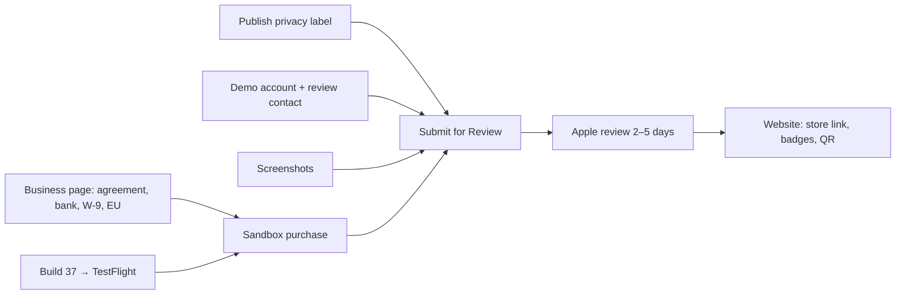

# Otto Launch Roadmap

As of 2026-09-24 · Juan Diego Lugo. Living copy: https://claude.ai/artifact/6HXbQRc9X1nfWpeiHAABRE

Otto ships with Otto Club for sale. Payments, the store listing text, the age rating and the
privacy answers are set up; what still blocks submission is the Paid Apps Agreement, a demo
account, screenshots and build 37.

Priority: **P0** blocks submission · **P1** needed before or on launch day · **P2** can follow.
Status: `todo` · `doing` · `blocked` · `done`.

## Where we are (2026-09-24)

The money path is wired end to end; nothing has been charged yet because the Paid Apps
Agreement is still pending.

| Area | Done today | Verified how |
| --- | --- | --- |
| App Store Connect | Group **Otto Club**: `otto_club_yearly` $39.99/yr and `otto_club_monthly` $4.99/mo, 1-week free trial on both, all 175 countries, display names set. Subtitle, categories (Food & Drink / Lifestyle), promo text, description, keywords, support/marketing/privacy URLs, copyright, review notes. Age rating computed **13+**. Seven privacy data types answered. Server Notifications point at RevenueCat. | Reloaded each page after saving |
| RevenueCat | App Store app `com.otto.recipes` with the IAP key (HTA6549CWG). Both products imported and attached to the `club` entitlement. Default offering: `$rc_annual` → yearly, `$rc_monthly` → monthly. Old "…Pro" entitlement deleted; Test Store products inactive and detached. Webhook → Supabase, all events, sandbox + production. | Read back on the entitlement, offering and webhook pages |
| App code | `RC_API_KEY` is the public `appl_` key; Test Store branches removed; fallback copy matches store ($39.99 / $4.99 / 7 days). Commit `f946bcae` on `main`. | `tsc` clean, 316/316 tests pass |
| Website | Pricing corrected on 9 pages + `llms.txt`; commit `05c668d`; Vercel deployed. | `ottosapp.com` and `/support` show $39.99 and 1-week trial |
| Supabase | No change needed. `revenuecat-webhook` (v4, live) checks entitlement `club`; `memberships` has RLS on, 0 rows. | Read the deployed function source and table |
| TestFlight | Build 36 (1.0.18) is "Ready to Submit", expires in 29 days. EAS CLI logged in. | ASC TestFlight page, `eas build:list` |

## Critical path to submission

Ten steps stand between today and "Submitted for Review". Juan owns the four that need a
legal signature, a login or a password; Claude owns the rest. The Business page and build 37
can run in parallel; the sandbox purchase needs both; Submit needs everything above it.

| # | Step | Owner | Blocked by | Status |
| --- | --- | --- | --- | --- |
| 1 | Business page: accept the updated Developer Program License Agreement, add bank account, submit W-9, declare EU trader status. Wait for Paid Apps Agreement = **Active** (Apple: hours to 2 days). | Juan | — | doing |
| 2 | App Privacy → **Publish** (top right). Answers are saved; the click is an accuracy attestation. | Juan | — | todo |
| 3 | Demo account: create a non-founder account in the app; Claude seeds it (saved recipes, week plan, shopping list); Juan types the email + password and his phone number into App Review Information and saves. | Juan + Claude | — | todo |
| 4 | Screenshots: six 6.9" store shots (iPhone 17 Pro Max simulator) + one paywall shot per subscription, uploaded to the version page and to each product's Review Information. | Claude | — | todo |
| 5 | Build 37: bump `expo.version` to 1.0.19 and `ios.buildNumber` to 37, set the ASC version string to match, `eas build` + `eas submit`, attach to the version. Build 36 must not ship (missing iPhone-only flag + privacy manifest). | Claude | — | todo |
| 6 | Set `EXPO_PUBLIC_USE_OTTO_RECIPES=true` for the `production` profile in `eas.json` before building 37, so the shipped app reads Otto's own recipe database as its copy claims. Smoke-test Discover, search, detail, nutrition. | Claude | — | todo |
| 7 | Sandbox purchase: create a Sandbox Apple ID (Users and Access → Sandbox), buy Otto Club in the TestFlight build, confirm the `club` entitlement unlocks and a row lands in `memberships`. Then Restore. | Juan (device) + Claude (verify) | 1, 5 | blocked |
| 8 | Attach the two subscriptions to the version and **Submit for Review**, release option "Automatically release after review". Log date + build in the publish ticket. | Juan | 1–7 | blocked |
| 9 | Apple review: answer any rejection the same day. Roughly 40% of first submissions are rejected; the usual causes (dead link, no demo login, privacy mismatch) are covered. | Both | 8 | blocked |
| 10 | Approval day: swap the website's "App Store link pending" QR for the real link, add store badges and the Smart App Banner, announce. | Claude | 9 | blocked |

## Apple Developer and App Store Connect

| ID | Ticket | Owner | Priority | Status |
| --- | --- | --- | --- | --- |
| ASC-1 | Accept the updated Apple Developer Program License Agreement (Account Holder only). Until accepted, Apple refuses new builds. | Juan | P0 | todo |
| ASC-2 | Business → Add Bank Account. | Juan | P0 | todo |
| ASC-3 | Business → Tax Forms → U.S. W-9 (required for any paid content, individual or not). | Juan | P0 | todo |
| ASC-4 | Business → Digital Services Act: declare trader or non-trader. Trader status publishes name, address, phone and email on the EU App Store. Alternative: remove EU countries from availability for v1. | Juan (decision) | P0 | todo |
| ASC-5 | Fix the legal address on file: it reads "4726 e michign st" and ZIP "32812-52". Tax forms are checked against it. | Juan | P0 | todo |
| ASC-6 | App Privacy → Publish. The seven data types are saved; the click attests they are accurate. | Juan | P0 | todo |
| ASC-7 | App Review Information: phone number, demo account email and password. Apple will not save the section without the phone. Needs APP-2. | Juan | P0 | blocked |
| ASC-8 | Upload six 6.9" screenshots (1320×2868) to the version page, in the shot-list order: import, cook mode, week plan, shopping list, Discover or recipe detail, Ask Otto. | Claude | P0 | done |
| ASC-9 | Add a paywall screenshot to Review Information on `otto_club_yearly` and `otto_club_monthly`. Apple rejects a product without one. | Claude | P0 | done |
| ASC-10 | Set the App Store version string to 1.0.19 so build 37 can be attached (the version page currently says 1.0; TestFlight builds carry 1.0.x). | Claude | P0 | done |
| ASC-11 | Pricing and Availability: confirmed Free, 175 countries; Mac App Store and Apple Vision Pro availability unchecked (app is iPhone-only). | Claude | P0 | done |
| ASC-12 | App Information → Content Rights: declared third-party content (TheMealDB), rights held. | Claude | P0 | done |
| ASC-13 | Build 37 attached to version 1.0.19. Adding both subscriptions + Submit for Review is next, once ASC-1–6 clear. | Juan | P0 | blocked |
| ASC-14 | Users and Access → Sandbox: create one Sandbox Apple ID for the test purchase. | Juan | P1 | todo |
| ASC-15 | Re-measure text lengths against the live limits. Entered today and accepted: subtitle 26/30, promo 144/170, keywords 92/100, description 1,597/4,000. | Claude | P1 | done |
| ASC-16 | Enroll in the Apple Small Business Program (15% commission instead of 30% under $1M/yr). Requires the Paid Apps Agreement to be Active first. | Juan | P1 | todo |

## App build and code

Build 37 is mandatory: build 36 predates the iPhone-only flag and the privacy manifest, so it
would ship as an iPad app with no declared manifest.

| ID | Ticket | Owner | Priority | Status |
| --- | --- | --- | --- | --- |
| APP-1 | Build 37: bumped to 1.0.19/37, built on EAS, submitted to App Store Connect — processed and "Ready to Submit" in TestFlight. | Claude | P0 | done |
| APP-2 | Demo review account. **Shortcut available:** the e2e account `claude-e2e-a@example.com` is already non-founder, seeded (3 favorites, 3 planned dishes, shopping list builds from them) and its password is in `.claude/skills/otto-lead/SKILL.md`. Juan can paste it into App Review Information as-is, or create a fresh one and I seed it the same way. | Juan | P0 | todo |
| APP-3 | `EXPO_PUBLIC_USE_OTTO_RECIPES=true` is set as an EAS environment variable on `production` and `preview` (checked with `eas env:list` 2026-09-24), so build 37 was built with it. `eas.json` needs nothing. Smoke-check on TestFlight: Discover, search, a recipe detail and its nutrition should load. | Claude | P0 | done |
| APP-4 | Sandbox purchase on the TestFlight build: buy, confirm `club` unlocks, confirm the paywall timeline reads "You'll be charged", Restore, and check the `memberships` row. **Build 37 is now in the Otto Insiders TestFlight group** — install the update on your phone; the test can start the moment the Paid Apps Agreement is Active. | Juan (device) + Claude (verify) | P0 | blocked |
| APP-5 | `ProfileScreen.tsx` "Rate Otto" now opens `https://apps.apple.com/app/id6792195637?action=write-review` (the App Store id already exists). Resolves once the listing is live. Ships in build 38+. | Claude | P1 | done |
| APP-6 | Speech input goes to Apple's servers (`requiresOnDeviceRecognition` unset). The code comment now says so correctly, and the privacy policy discloses it (LEG-2, live). Remaining decision only: force on-device (fewer languages, works offline) or keep as is. | Juan (decision) | P2 | todo |
| APP-7 | Strip EXIF/GPS from uploaded recipe photos (HEIC library picks are uploaded untouched). **Done 2026-09-24:** `preferredAssetRepresentationMode: Compatible` in `src/shared/imagePicker.ts`. iOS transcodes HEIC to JPEG and the picker re-encodes it, which drops EXIF. No new dependency. **Ships in the next build (38+). Build 37 still uploads HEIC untouched.** LEG-3 verifies it on a device. | Claude | P1 | done |
| APP-8 | Add Sentry crash reporting, then tick Diagnostics on the privacy label. Needs a native rebuild, so it rides with 1.0.19 or later. | Claude | P2 | todo |
| APP-9 | Server-side enforcement of the free tier (5 imports/month, 25 saves, 5 asks/day) in the edge functions, counting against `memberships`. Today the limits live only in `club.limits.ts` on the device. | Claude | P2 | todo |
| APP-10 | Decide whether the week planner and smart shopping list are Club features. The go-live doc lists them as Club, but nothing gates them today. | Juan (decision) | P2 | todo |
| APP-11 | AI cost controls: log `input_tokens`/`output_tokens` per call (no content), then the five items in `docs/history/AI_COST_DIET.md` (measure, Haiku for chat, Sonnet for vision, trim prompts, Batch API for catalog jobs). **Logging done 2026-09-24** (generate-recipe v14 writes an `anthropic_usage` JSON line on every call, JSON and stream paths; no content logged). First reading: chat = 11 input + ~220 output tokens + a 1472-token system prefix that is served from cache on repeat calls. The model-mix items stay open until there is real traffic to measure. | Claude | P2 | in progress |
| APP-12 | Support address: keep `juandiego@ottosapp.com` in the app, on the site and on the listing. Decided 2026-09-24; `STORE_METADATA.md` still recommends `support@` and should be updated. | Juan | P1 | done |
| APP-13 | **Import claims made true (2026-09-24).** Found two live bugs behind the listing's "Paste a link, a video, or the words themselves". (1) A TikTok or Instagram link always failed ("No recipe found"): import-recipe read only schema.org data. It now falls back to the post caption (TikTok oEmbed, Instagram og:description) and transcribes it via generate-recipe's new `{text}` mode, credited `@creator` with a link back. (2) Pasting a recipe over 600 characters failed with "Invalid body": `{text}` takes up to 8,000 and transcribes instead of inventing. Both are server-side (import-recipe v9, generate-recipe v15), so **build 37 has them now**. The app's paste box moves to `{text}` in build 38+. Tested live: TikTok, Instagram reel, BBC Good Food (no regression), Wikipedia (declined), and a 648-character paste. Facebook Reels untested: its pages sit behind a login. | Claude | P0 | done |

## RevenueCat and payments

| ID | Ticket | Owner | Priority | Status |
| --- | --- | --- | --- | --- |
| RC-1 | See the sandbox purchase (APP-4) arrive in RevenueCat → Customers with the `club` entitlement active, and the webhook event delivered (Integrations → Webhooks → event log). The products' "Could not check" status clears after the subscriptions are submitted with the app. | Claude | P0 | blocked |
| RC-2 | Checked RevenueCat's bundled `PrivacyInfo.xcprivacy`: it declares only Purchase History, no Device ID. Removed Device ID from the (unpublished) privacy label — now 6 types, not 7. | Claude | P1 | done |
| RC-3 | Done: `delete-account` now also calls `DELETE /v1/subscribers/{uid}` on RevenueCat, best-effort, before the auth user is dropped. Deployed as delete-account v8. | Claude | P2 | done |
| RC-4 | Once ASC-16 is approved, turn on "Apple Small Business Program" in the RevenueCat app settings so revenue reporting uses 15%. | Claude | P2 | todo |
| RC-5 | Webhook signing: **closed, not needed.** The handler never trusts the event payload. Every call re-fetches the subscriber from the RevenueCat API with the secret key and mirrors that. A forged call with a leaked header can only trigger a correct re-sync. The shared Authorization header stays as the gate. | Claude | P2 | done |
| RC-6 | Optional: a RevenueCat Paywall or Experiment for the annual-vs-monthly price test in the ASO plan. Not before the first real cohort. | Juan (decision) | P2 | todo |

## Supabase and backend

Nothing here blocks submission. The live project's security advisor shows 3 warnings and the
performance advisor 14 (2026-09-24).

| ID | Ticket | Owner | Priority | Status |
| --- | --- | --- | --- | --- |
| SB-1 | Decide on the plan before launch: the free tier auto-pauses when idle (`keepalive.yml` prevents it today) and has no daily backups. Pro is $25/month and adds backups and no pause. | Juan (decision) | P1 | todo |
| SB-2 | Auth → enable leaked-password protection (HaveIBeenPwned check). One toggle: Dashboard → Authentication → **Attack Protection** → "Prevent use of leaked passwords" → Save. Claude cannot do it: the dashboard session in Chrome needs a sign-in. | Juan | P1 | todo |
| SB-3 | Settled: read live `function_edge_logs`. Confirmed — every search call logs the full query string, the caller's user id, IP, and precise city/postal-code location together. Policy text needs a rewrite (LEG-2); label may need Search History/Precise Location. | Claude | P1 | done |
| SB-4 | Settled: read real rows. Email/password stores no name; Apple stores `username`; Google additionally stores a profile photo URL (`picture`/`avatar_url`) — a new finding, not previously in the truth table. No Facebook user yet observed. | Claude | P1 | done |
| SB-5 | Advisor: `get_list_share`, `get_recipe_share` (anon) and `join_household` (authenticated) are SECURITY DEFINER and callable. Documented as intentional with `COMMENT ON FUNCTION` — verified each strips or never stores owner user_id before commenting. | Claude | P2 | done |
| SB-6 | Done: wrapped `auth.uid()` in `(select …)` on 5 policies; merged the duplicate permissive SELECT policies on `plan_entries` and `recipes` into one each (verified `private.shares_household()` always returns false for anon, so merging to `authenticated`-only is not a narrowing). Both advisor warnings now clear. | Claude | P2 | done |
| SB-7 | Done, minimal fix: `uploadRecipePhoto` now names files `<uid>/<uuid>.<ext>` instead of `<uid>/<timestamp>.<ext>`. Bucket stays public (by design, no list policy) — removes guessability without a signed-URL rework. | Claude | P2 | done |
| SB-8 | `resolved_ingredients` is readable by anon and is not cleared by account deletion; the free-text ingredient names a user typed become globally readable rows. Decide: keep (shared cache) or scope it. | Juan (decision) | P2 | todo |
| SB-9 | Deliberately held, not attempted: build 37 has the current anon key baked in and is mid-flight to Apple review right now. Rotating keys before that resolves risks breaking the submitted build. Revisit after build 37 is either live or superseded. | Claude | P2 | todo |
| SB-10 | Seven unused indexes reported by the advisor. Leave until there is traffic to judge by. | Claude | P2 | todo |
| SB-11 | **Done 2026-09-24. Found and fixed a launch blocker: account deletion was broken in production.** `admin_delete_user_data` still deleted from the dropped `collab_items`/`collab_lists` tables, so every in-app "Delete account" returned 500 (App Store 5.1.1(v)). Fixed server-side (migration `fix_admin_delete_user_data_drop_collab`). No app build needed, so build 37 is fixed too. `rls-attacks.test.mjs` is rewritten for today's schema (kitchens, shared list, a user granting himself a membership) and deletes its own users through delete-account: **69 passed, 0 failed.** Still left: 8 throwaway `otto-rls-*@example.com` users from July (safe to delete). | Claude | P2 | done |

## Website and Vercel

The site is correct for review today (pricing, privacy, terms, support all live). The one P0
is listing-day work that needs the App Store ID, which only exists after approval.

| ID | Ticket | Owner | Priority | Status |
| --- | --- | --- | --- | --- |
| WEB-1 | Approval day: set `APP_STORE_URL` and `APP_STORE_ID` in `lib/metadata.ts`. That links the store badge on seven pages, turns on the Smart App Banner and `downloadUrl`, and replaces the "App Store link pending" QR box in the hero and download sections. | Claude | P0 (after approval) | blocked |
| WEB-2 | Send a test email from an outside account to `juandiego@ottosapp.com` and confirm it arrives. Apple's reviewer may write to it. | Juan | P1 | todo |
| WEB-3 | Contact form: without `RESEND_API_KEY` and `CONTACT_TO_EMAIL` on Vercel, a message is only logged and the sender still sees success. Either add the two env vars (needs a Resend account) or replace the form with a mailto link. | Juan (decision) + Claude | P1 | todo |
| WEB-4 | Decide whether `/careers` stays. The self-audit flags it as P1; it is still in the nav and footer. | Juan (decision) | P1 | todo |
| WEB-5 | Doc hygiene: `app/support/page.tsx:14-15` still says the support email is "undecided"; `brief/ASO_PLAN.md` appendix still says $45/yr and a 5-day trial; the publish ticket's F8 text still says `otto.club.*`, $34.99 and 5 days. | Claude | P1 | done |
| WEB-6 | Done: real shopping-list capture (from the store-screenshot session) added as `public/app/app--shopping.png`; "See it" section restored to five steps. | Claude | P2 | done |
| WEB-7 | SEO content pages: **11 of 15 live.** Added 2026-09-24: Crouton, private recipe app, import-from-any-website, Samsung Food, and the Instagram, TikTok and Facebook Reels guides (claims match import-recipe v9). Site-wide: the app name now matches the listing, and three unbacked claims were removed (share extension, failed import "opens the editor", "credit cannot be removed"). Left: #13 Mealime, #14 organize hub, #15 alternatives hub. | Claude | P2 | in progress |
| WEB-8 | Self-audit re-check done 2026-09-24 (notes in `brief/AUDIT_SELF.md`). Fixed: #16 OttoMoment line at display scale, #11 sad otter on the 404. Resolved: #10, #14, #17. Won't fix: #18 (TheMealDB labels shown as recorded). **Open, founder design calls:** #5 hero, #6 section rhythm, #7 motion, #8 recipe grid, #12 phone size, #15 import sequence. | Claude | P2 | done |
| WEB-9 | `/press` is live: description, key facts, icon and 4 real captures with downloads. Launch status switches automatically when `APP_STORE_URL` is set. The cook and plan captures are only 415×900. Swap in the 1320×2868 store shots if press asks. | Claude | P2 | done |

## Legal and privacy

| ID | Ticket | Owner | Priority | Status |
| --- | --- | --- | --- | --- |
| LEG-1 | Publish the App Privacy label (same as ASC-6). Seven types: Name, Email, User ID, Device ID, Purchase History, Photos or Videos, Other User Content; all App Functionality, linked, no tracking. | Juan | P0 | todo |
| LEG-2 | Done: rewrote `legal/PRIVACY_POLICY.md` — named Anthropic/RevenueCat/USDA, added uploaded-photo and voice-input disclosure, added the confirmed search-log retention finding (SB-3), removed Railway, updated §7 to reflect RC-3. Live on ottosapp.com/privacy. | Claude | P1 | done |
| LEG-3 | EXIF/GPS test: upload a geotagged HEIC as a recipe photo, `curl` the public URL, run `exiftool -gps:all`. If GPS survives, ship APP-7 and add Precise Location to the label until it does. | Claude | P1 | todo |
| LEG-4 | EU Digital Services Act trader declaration (same as ASC-4). | Juan | P0 | todo |
| LEG-5 | Terms set a 13+ minimum; Apple computed a 13+ rating. Consistent; nothing to change. | — | — | done |
| LEG-6 | Counsel review of the Terms and Privacy Policy. The website README calls it "a decision, not a task". | Juan (decision) | P2 | todo |
| LEG-7 | When Sentry lands (APP-8), tick Diagnostics → Crash Data on the privacy label and re-publish. | Claude | P2 | todo |

## Marketing and ASO

Targets from the ASO plan: 200+ ratings at 4.6+ by day 90, re-set against real numbers at day 30.

| ID | Ticket | Owner | Priority | Status |
| --- | --- | --- | --- | --- |
| MKT-1 | App name is entered as "Otto: Recipes & Meal Plans" (store metadata doc). The ASO plan prefers "Otto: Recipe Keeper & Planner". Keep the entered name for v1; test the other in the v1.1 metadata release. | Juan (decision) | P1 | todo |
| MKT-2 | Launch-day announcement: store badges and QR live on the site (WEB-1), a launch post, and outreach with the press kit (WEB-9). Channels and copy per the brand brief. | Juan + Claude | P1 | blocked |
| MKT-3 | 30-second App Preview video for the listing (ASO plan §6). Optional for v1. | Claude | P2 | todo |
| MKT-4 | Ratings prompt: `expo-store-review`, Trigger A from ASO plan §8. It fires ~1.5s after the **3rd** finished cook, with a 90-day cooldown (`src/features/cook/reviewPrompt.ts`, rule unit-tested). Triggers B/C and the suppression windows wait for real ratings data. Native module, so it ships in build 38+. | Claude | P2 | done |
| MKT-5 | Apple Search Ads Discovery campaign, small daily budget, once ratings exist. | Juan | P2 | todo |
| MKT-6 | Localization: **es-MX and en-GB metadata drafted** in `docs/release/STORE_METADATA_LOCALIZED.md` (name, subtitle, keywords, promo, description; lengths measured; no prices, so each storefront shows its own currency; es-MX says the app is in English). Juan reviews the Spanish, then pastes it into App Store Connect. de-DE waits for real translation and importer testing. | Claude | P2 | in progress |
| MKT-7 | Product page tests: the five A/B tests and Custom Product Pages in ASO plan §10, following the v1.0 → v1.1 → v1.2 metadata sequence. | Both | P2 | todo |
| MKT-8 | In-App Events in App Store Connect for seasonal moments (first one after launch, not before). | Juan | P2 | todo |
| MKT-9 | Day 30: re-set the ASO targets against real installs, conversion and ratings; fix the plan's appendix pricing ($45 → $39.99, 5-day → 1-week). | Both | P2 | todo |

## Risks we are carrying into v1

| Risk | Why it is accepted | Mitigation in place | Fix when |
| --- | --- | --- | --- |
| 792 of 795 recipe photos are hotlinked from `themealdb.com` | Re-hosting is days of work and App Review will not catch it | Website and both legal documents credit TheMealDB; that credit must stay | First month: re-host or replace the photos |
| Uploaded iPhone photos may keep EXIF/GPS (HEIC library picks are uploaded untouched) | Low exposure on a recipe app; the storage bucket is public-read | Privacy label answered without Precise Location; truth table row 9 flags it | Week one: strip metadata on upload, then re-check the label |
| No crash reporting or analytics | Adding Sentry needs a native rebuild; no beta gate needs it | App Review notes and reviews are the only signal | v1.0.19: add Sentry, then tick Diagnostics on the privacy label |
| Free-tier limits are enforced only on the device (`club.limits.ts`) | Cost exposure, not a launch blocker | Per-call AI caps: 4000 output tokens, 20 calls / 15 min / user, auth before any token | First month: server-side enforcement in the edge functions |
| Roughly 40% of first submissions are rejected | Apple's clock, not ours | Demo account, live URLs, privacy label match are all on the critical path | Answer any rejection the same day; a rejection is a resubmit, not a restart |

## After launch: the v1.0.19+ backlog

| When | Work | Tickets |
| --- | --- | --- |
| Approval day | Store link, badges, Smart App Banner, QR; announcement; rate-app deep link | WEB-1, MKT-2, APP-5 |
| Week 1 | EXIF/GPS test and strip; privacy policy vendor names; support mailbox check; contact form decision; leaked-password protection | LEG-3, APP-7, LEG-2, WEB-2, WEB-3, SB-2 |
| Month 1 | Sentry + Diagnostics label; server-side free-tier limits; re-host or replace the 792 TheMealDB photos; Small Business Program; RevenueCat subscriber deletion | APP-8, LEG-7, APP-9, ASC-16, RC-4, RC-3 |
| Month 1 | Day-30 ASO reset; ratings prompt; first Search Ads test | MKT-9, MKT-4, MKT-5 |
| Month 2–3 | AI cost controls (token logging, model mix, Batch API); Supabase RLS and key rotation; photo bucket hardening; planner/shopping-list gating decision | APP-11, SB-6, SB-9, SB-7, APP-10 |
| Month 2–3 | SEO pages (11 remaining); localization; product-page A/B tests; App Preview video | WEB-7, MKT-6, MKT-7, MKT-3 |

## Decisions only Juan can make

- [ ] EU trader status: declare (public contact details in the EU) or exclude EU countries for v1 (ASC-4)
- [ ] Speech input: on-device recognition or keep Apple server recognition and disclose it (APP-6)
- [ ] Supabase plan: stay on free with the keep-alive, or move to Pro before launch (SB-1)
- [ ] Contact form: add Resend keys on Vercel or switch to a mailto link (WEB-3)
- [ ] Keep or remove `/careers` (WEB-4)
- [ ] Planner and smart shopping list: Club-only or free (APP-10)
- [ ] App name test in v1.1: "Recipes & Meal Plans" vs "Recipe Keeper & Planner" (MKT-1)
- [ ] Counsel review of the legal documents (LEG-6)

## Sources

- Recipe-App: `docs/tickets/TERMINAL_TICKET_PUBLISH.md`, `docs/history/OTTO_CLUB_GOLIVE.md`, `docs/release/STORE_METADATA.md`, `docs/legal/APP_PRIVACY_TRUTH_TABLE.md`, `docs/history/AI_COST_DIET.md`
- Otto_Website: `README.md`, `brief/AUDIT_SELF.md`, `brief/ASO_PLAN.md`, `brief/PRE_LAUNCH_CHECKLIST.md`, `lib/metadata.ts`, `lib/contact.ts`
- App Store Connect, RevenueCat and Supabase dashboards read on 2026-09-24; Supabase security and performance advisors
